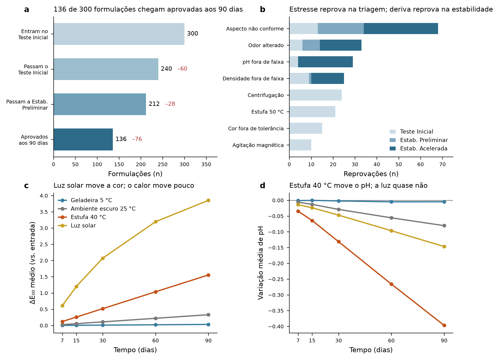

# Funil de estabilidade de produtos formulados

Simulação de controle de qualidade e estudo de estabilidade de saneantes (produtos de limpeza) formulados, modelado como o funil de três estágios usado na prática de laboratório de desenvolvimento: triagem de bancada → estabilidade preliminar → estabilidade acelerada.

A pergunta que o projeto responde: **é possível prever, com os ensaios do dia zero, quais formulações sobrevivem aos 90 dias de estudo de estabilidade?**

> **Status:** completo — dataset, validação, funil, previsão antecipada e clusterização de assinaturas de degradação.

## Por que isso importa

Cada formulação que entra no estudo acelerado ocupa câmara climática, bancada e analista por 90 dias. Antecipar a reprovação em meia hora de triagem economiza três meses de ciclo de desenvolvimento.

## Os três estágios

| Estágio | Condição | Avaliações | Portão |
|---|---|---|---|
| **1. Teste Inicial** | dia 0 — estufa 50 °C 48 h, centrifugação 3000 rpm/30 min, agitação magnética | organolépticas, pH, densidade | reprova em qualquer ensaio encerra |
| **2. Estabilidade Preliminar** | choque térmico: geladeira 5 °C ↔ estufa 40 °C em dias alternados | 15 e 30 dias | portão no dia 30 |
| **3. Estabilidade Acelerada** | ambiente escuro 25 °C, estufa 40 °C, geladeira 5 °C, luz solar | 7, 15, 30, 60 e 90 dias | desfecho final |

Parâmetros avaliados: aspecto, cor, odor, pH e densidade — os mesmos de uma planilha de controle de qualidade real, incluindo os campos descritivos em texto livre.



## Estrutura

```
data/     dados gerados (ver data/README.md para o dicionário de dados)
src/      pipeline numerado, 01 a 05
output/   figuras e métricas
relatorio/ relatório técnico com a justificativa das escolhas de domínio
```

## Como rodar

```bash
pip install -r requirements.txt
OUT_DIR=data python src/01_gerar_dataset.py        # gera os 7 CSV em data/
python src/02_preparar_dados.py                    # valida schema, julga vs. spec, diagnostica qualidade
python src/03_analise_funil.py                      # atrito, causas, efeito de fornecedor
python src/04_previsao_antecipada.py                 # previsão antecipada, 3 horizontes
python src/05_clusterizacao.py                       # agrupamento por assinatura de degradação
```

Todo o pipeline é determinístico (seed 42): rodar do zero reproduz `data/` e `output/` por inteiro, byte a byte nas colunas numéricas.

## Resultados principais

**Funil:** das 300 formulações que entram no Teste Inicial, 247 passam o Estágio 1, 209 chegam à Estabilidade Acelerada e **128 sobrevivem aos 90 dias** — 42,7% cumulativo (de tudo que entrou) e 61,2% condicional (de quem chegou ao Estágio 3; os dois números respondem perguntas diferentes, ver `relatorio/relatorio_tecnico.md`).


O fornecedor de tensoativo **não** separa a aprovação no Teste Inicial (χ² = 3,25, p = 0,20, n = 300) mas **separa** a sobrevivência aos 90 dias (χ² = 10,92, p < 0,01): FOR-B sobrevive a 29,8% contra 52,8% do FOR-C. O efeito existe, só não é visível no dia 0.

**Previsão antecipada:** um Random Forest treinado só com os ensaios do Teste Inicial (dia 0) prevê a sobrevivência aos 90 dias com **AUC 0,777 contra baseline de classe majoritária de 0,652 (n = 46 lotes de teste, divisão temporal)** — ponto único, sem intervalo de confiança (ver Limitações). Recall de 75% na classe de falha (12 de 16 falhas capturadas) com limiar calibrado por custo (4:1 entre deixar passar uma falha e investigar uma formulação boa à toa).


Achado que teria sido fácil esconder e não escondi: **esperar 30 ou 37 dias não melhora a previsão** (AUC permanece 0,78 nos 3 horizontes) — o sinal que decide o desfecho já está presente no dia 0. E a validação aleatória (controle, não é o número certo a reportar) dá AUC 0,86 — mais alta que a temporal, o gap de otimismo esperado quando o teste é embaralhado em vez de vir do futuro.

**Clusterização:** agrupando os 209 lotes que chegaram ao Estágio 3 pela *assinatura* de degradação (inclinação de pH, amarelecimento e escurecimento em cada condição — não pelo nível absoluto), o K-means encontra **k = 2** (silhueta 0,40, confirmado por Ward, ARI = 1,0 entre os dois métodos). O agrupamento **corta as 6 famílias declaradas** (ARI = 0,27 contra a família nominal): um cluster reúne Alvejante e Desinfetante — química oxidante, mais fotossensível — e o outro reúne as quatro famílias à base de tensoativo, mais sensível a calor que a luz.


**Qualidade do dado (Passo 2):** dos 300 lotes, a regra reconstruída a partir da `spec_master` reproduz a disposição registrada em 293 (as 7 divergências são todas medição fisicamente impossível, não erro de regra). **10 lotes foram reprovados indevidamente** por erro de laboratório (a sonda PH-02 leu +0,305 de pH acima do real entre jul–nov/2024). Kappa quadrático entre analistas: 0,88–0,93.

## Decisões técnicas

Detalhe e justificativa completa em [`relatorio/relatorio_tecnico.md`](relatorio/relatorio_tecnico.md). As mais defensáveis em entrevista:

- **ΔE₀₀ (CIEDE2000)**, não ΔE\*ab de 1976 — é o que a ASTM D2244 recomenda para diferenças de 0 a 5 unidades, faixa em que este projeto opera.
- **ΔE de liberação (lote vs. padrão, T0) é separado do ΔE de fotoestabilidade** (lote vs. si mesmo, sob luz, aos 90 dias) — são perguntas diferentes; confundi-las no rascunho anterior do dataset criava colinearidade perfeita e um critério de liberação fisicamente absurdo.
- **Regra de liberação é conjuntiva (AND)**, não score ponderado — nenhum parâmetro compensa outro fora de especificação. Score ponderado aparece só como ferramenta de priorização (importância por permutação no Passo 4), nunca como critério de aprovação.
- **A `spec_master` é a única fonte de verdade dos limites** — nenhum script re-implementa um limite em código; ela é versionada por vigência (a tolerância de cor mudou em 2024-10-01) e tem exceções documentadas por família (precipitado fino aceito em 2 famílias).
- **Validação de schema (Pandera) na ingestão**, separada da lógica de negócio: o schema falha por estrutura malformada (coluna ausente, categoria desconhecida); a Seção 5–10 do Passo 2 é que decide se um valor é fisicamente impossível ou apenas fora de especificação — confundir as duas transformaria o diagnóstico de qualidade do dado em erro do script.
- **Divisão temporal para validar o modelo**, com a divisão aleatória mantida só como controle explícito — é a única forma honesta de simular "prever formulações futuras com um modelo treinado no passado".
- **`analista` e `instrumento_ph` excluídos das features** do Passo 4 de propósito: são identidade de quem mediu, não propriedade do produto. Incluí-los arriscaria o modelo aprender o viés de instrumento do Passo 2 disfarçado de sinal preditivo.

## Limitações

- **Dataset inteiramente sintético.** Não é dado industrial real, e nenhum valor aqui deve ser lido como especificação de produto — ver `FONTES.md` para o que é literatura [LIT] e o que é estimativa de engenharia [EST].
- **n = 300 formulações**, das quais só 209 chegam ao Estágio 3. Isso é viés de seleção real (o funil filtra antes de gerar dado de estabilidade completa), não um defeito — mas reduz o n efetivo do modelo do Passo 4 para 209, e o teste temporal para 46.
- **Gap de otimismo entre divisão temporal e aleatória:** AUC 0,777 (temporal, a que vale) contra 0,861 (aleatória, controle). Não investiguei formalmente a causa; a candidata mais provável é a revisão de spec de 2024-10-01, que desloca a distribuição do alvo entre treino e teste.
- **Nenhum intervalo de confiança nas métricas do Passo 4** — são estimativas pontuais em n = 46 de teste. Um bootstrap ou repetição da divisão temporal com folds deslizantes daria a incerteza; não foi feito nesta versão.
- **Limiar de custo (4:1) é arbitrário**, escolhido para ilustrar o método, não calibrado contra custo real de câmara climática ou de investigação de bancada.
- **Clusterização usa só 12 features de inclinação** (pH, amarelecimento, escurecimento × 4 condições) — densidade e aspecto/odor não entraram no vetor; um vetor mais rico poderia revelar mais que 2 clusters.
- **O que não foi avaliado:** cartas de controle e OOT sistemático (Passo 2 já mede candidatos, mas sem carta formal), SHAP em vez de importância por permutação, modelo de shelf life por regressão linear mista, dados de matéria-prima e genealogia de lote — todos na lista de Próximos Passos abaixo.

## Próximos passos

- cartas de controle (Shewhart, EWMA, CUSUM) e detecção de fora de tendência (OOT)
- estimativa de prazo de validade por modelo linear misto, com teste de poolabilidade de lotes
- monitoramento multivariado (T² de Hotelling) para os parâmetros correlacionados
- dados de matéria-prima e genealogia de lote

## Referências metodológicas

O desenho do estudo segue metodologia pública: ANVISA — *Guia de Estabilidade de Produtos Cosméticos* (Série Qualidade em Foco, vol. 1); ISO/TR 18811:2018; ICH Q1A(R2), Q1B, Q1D e Q1E. Métodos de ensaio: ASTM E70 e ISO 4316 (pH); ASTM D2244, ASTM E308 e ISO/CIE 11664-4/-6 (cor); ISO 22716 (boas práticas de fabricação). Tratamento de resultados fora de especificação conforme o *FDA Guidance for Industry: Investigating Out-of-Specification Test Results*.

Os dados são **inteiramente sintéticos**, gerados a partir dessa metodologia pública. O projeto não contém dado industrial real.

## Licença

MIT — ver [LICENSE](LICENSE).
