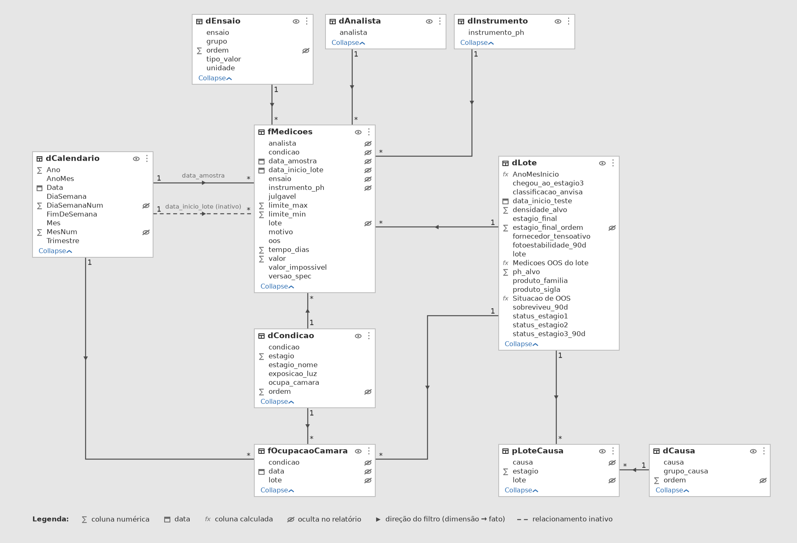

# Modelo semântico de estabilidade (Power BI)

Modelo estrela sobre os dados do funil de estabilidade de formulados. A pergunta que ele responde:

> **Quanto do tempo de câmara climática é consumido por formulações que acabam reprovadas, e onde (família, fornecedor, causa) esse desperdício se concentra?**

No dataset sintético, **37,2% dos dias-câmara (29.340 de 78.870) foram ocupados por lotes que não sobreviveram aos 90 dias.** Esse é o número-âncora do relatório.


Mesmo modelo no formato da Exibição de modelo do Power BI Desktop (colunas em ordem alfabética, chaves estrangeiras e colunas de ordenação ocultas, seta de filtro dimensão → fato):



## Estado desta entrega

| Item | Estado |
|---|---|
| Dataset (`data/dados_longo.csv`) | datas do estágio 3 corrigidas na origem; pipeline 02 a 05 revalidado (ver achado 1) |
| Tabelas do modelo (`dados_modelo/*.csv`) | gerado e validado em pandas |
| Valores de referência (`valores_de_referencia.csv`, `referencia_mensal.csv`) | gerado; asserções contra os números do README do projeto passaram |
| Scripts Power Query (`M/*.pq`) | escritos; **não executados no Power BI Desktop** |
| Medidas, colunas e tabelas DAX (`DAX/*.dax`) | escritas; **não executadas no Power BI Desktop** |
| Arquivo `.pbix` | **ainda não existe**: é montado no Desktop seguindo o passo a passo abaixo |

Não há motor DAX nem M no ambiente em que isto foi produzido. A garantia de correção vem da conferência: `DAX/validacao.dax` reproduz no modelo cada valor de referência calculado em pandas. Qualquer divergência aponta um erro de relacionamento, de tipo ou de medida, e deve ser corrigida antes de construir visuais.

## Tabelas e grão

| Tabela | Tipo | Grão | Linhas |
|---|---|---|---|
| `fMedicoes` | fato | lote × condição × ensaio × tempo (dias) | 29.421 |
| `fOcupacaoCamara` | fato | lote × condição × **dia ocupado** | 78.870 |
| `pLoteCausa` | ponte M:N | lote × causa de reprovação | 212 |
| `dLote` | dimensão | lote (família e fornecedor já desnormalizados) | 300 |
| `dCondicao` | dimensão | condição de armazenamento (6) e estágio (3) | 6 |
| `dEnsaio` | dimensão | ensaio, grupo e tipo de valor | 11 |
| `dAnalista` | dimensão | analista, mais `N/D` | 4 |
| `dInstrumento` | dimensão | sonda de pH, mais `N/D` | 3 |
| `dCausa` | dimensão | causa normalizada e agrupada | 8 |
| `dCalendario` | dimensão | dia; **gerada em M**, não importada | 731 |
| `dSeletorTaxa`, `dParametroCusto` | desconectadas | seletor e parâmetro what-if | 2 e 51 |

### Relacionamentos

Todos são 1 → * (dimensão para fato), filtro em uma direção só.

| De (1) | Para (*) | Estado |
|---|---|---|
| `dCalendario[Data]` | `fMedicoes[data_amostra]` | ativo |
| `dCalendario[Data]` | `fMedicoes[data_inicio_lote]` | **inativo** (ativado por `USERELATIONSHIP`) |
| `dCalendario[Data]` | `fOcupacaoCamara[data]` | ativo |
| `dLote[lote]` | `fMedicoes[lote]`, `fOcupacaoCamara[lote]`, `pLoteCausa[lote]` | ativo |
| `dCondicao[condicao]` | `fMedicoes[condicao]`, `fOcupacaoCamara[condicao]` | ativo |
| `dEnsaio[ensaio]` | `fMedicoes[ensaio]` | ativo |
| `dAnalista[analista]` | `fMedicoes[analista]` | ativo |
| `dInstrumento[instrumento_ph]` | `fMedicoes[instrumento_ph]` | ativo |
| `dCausa[causa]` | `pLoteCausa[causa]` | ativo |

## Decisões de modelagem

**1. Papel duplo da data, e por que ele não passa por `dLote`.** O plano inicial dizia "data de fabricação × data de análise". O dataset não tem data de fabricação; tem `data_inicio_teste` (início do estudo do lote) e `data_amostra` (dia de cada medição). O papel duplo usa esse par. `data_inicio_lote` é replicada como chave estrangeira em `fMedicoes` porque ligar o calendário também a `dLote` criaria dois caminhos de filtro até `fMedicoes` (ambiguidade), e o Power BI desativaria um deles sem aviso.

**2. Ponte M:N entre lote e causa, sem filtro bidirecional.** O plano inicial citava uma ponte lote↔ensaio. Os dados pedem lote↔causa: 32 dos 173 lotes reprovados têm mais de uma causa gravada em texto com `;`, algumas repetidas ("aspecto nao conforme; aspecto nao conforme; odor alterado"). A ponte normaliza (com deduplicação) em 212 linhas. `dLote` e `dCausa` são o lado "1" e a ponte é o lado "*" de ambos, então nenhum precisa de filtro bidirecional: as medidas contam a partir da ponte (`DISTINCTCOUNT(pLoteCausa[lote])`). Consequência aceita: a soma de "lotes por causa" passa de 173, porque um lote com duas causas aparece nas duas.

**3. Duas taxas de sobrevivência, nunca misturadas.** A taxa cumulativa (127/300 = 42,3%) e a condicional (127/199 = 63,8%) respondem perguntas diferentes, como já distingue o README do projeto. Um segmentador sobre `dSeletorTaxa` alterna entre elas numa medida só.

**4. OOS de medição não é reprovação de lote.** 179 lotes têm pelo menos uma medição fora de especificação, mas só 173 foram reprovados. As duas medidas coexistem e o contraste entre elas é intencional.

**5. Colunas removidas da fato.** `descritivo` (texto livre, 14.286 valores preenchidos, cardinalidade alta), `produto_familia` (redundante com `dLote`), `estagio` (vem de `dCondicao`), `criterio_tipo` e `excecao_permitida`. Nenhuma tem uso analítico na fato e todas aumentam o tamanho do modelo.

**6. Nulos de chave viram `N/D`.** `analista` e `instrumento_ph` são nulos em 100% das medições dos estágios 2 e 3 (e preenchidos em 100% do estágio 1). Deixar nulo criaria o membro (Blank) nos segmentadores. Consequência: análise por analista ou por sonda só faz sentido no estágio 1.

**7. Semiaditiva por construção.** `fOcupacaoCamara` tem uma linha por dia ocupado. Somar linhas dá dias-câmara (aditivo). Contar linhas de um único dia dá câmaras ocupadas (foto, não aditivo no tempo). A medida `Câmaras ocupadas (último dia com dado)` usa `LASTNONBLANK` para respeitar isso.

## Achados sobre o dataset e decisões tomadas

1. **Estágios 2 e 3 sobrepostos: corrigido na origem.** Em `02_preparar_dados.py`, a data da amostra do estágio 3 era `data_inicio + tempo_dias`, o que colocava a janela do estágio 3 no mesmo dia da janela do estágio 2 (defasagem 0 nos 1.037 grupos), embora o funil seja sequencial. Passou a ser `data_inicio + 30 dias (portão do estágio 2) + tempo_dias`. A correção foi validada antes de ser aplicada: rodei o pipeline 02 a 05 numa cópia isolada sem alteração (idêntica ao repositório, byte a byte, inclusive os PNGs) e numa cópia corrigida. **O único arquivo que difere é `data/dados_longo.csv`**, e nele só mudou `data_amostra` das 23.880 linhas do estágio 3 (+30 dias). Nenhum julgamento, nenhuma taxa e nenhuma figura de `output/` mudou, porque o único ensaio cuja spec muda de versão (`delta_e_liberacao`, v1.0 → v1.1 em 2024-10-01) pertence ao estágio 1. Efeito no modelo: o total de dias-câmara e o desperdício não mudam; o **pico de ocupação caiu de 208 para 199 câmaras (em 2025-05-15)**, o que mostra que o pico anterior era um artefato da sobreposição, e a série passou a terminar em outubro de 2025. O exportador `06` agora falha se os estágios voltarem a se sobrepor.
2. **Lotes reprovados no estágio 3 permanecem 90 dias na câmara** (288 combinações lote × condição, todas com `tempo_dias` máximo de 90), porque o critério só é julgado ao final. Também cumpriram os 30 dias do estágio 2. Por isso cada um consumiu 30 + 360 = 390 dias-câmara, não 360. É uma propriedade do desenho do estudo e permanece.
3. **Custo: a métrica principal é dias-câmara, não reais.** O dataset não contém custo. O número-âncora do relatório é **37,2% dos dias-câmara desperdiçados**, que vem dos dados. O valor em reais (R$ 1.467.000 com R$ 50 por dia-câmara) aparece só como análise de sensibilidade, pelo parâmetro `dParametroCusto`, e sempre rotulado como premissa ilustrativa.
4. **pH só é interpretável dentro de uma família.** Os alvos vão de 3,2 (amaciante) a 10,2 (limpador alcalino), então a média e o desvio-padrão globais (6,97 e 2,49) misturam escalas. A validação usa o desvio contra o alvo da família (`Desvio médio do pH vs alvo`, -0.0892 no total) e a média e o desvio-padrão **por família** (desvio-padrão entre 0,21 e 0,30). As medidas globais continuam disponíveis, mas nenhum visual deve exibi-las sem filtro de família.
5. **`cor_score` não tem critério na spec** e, junto com as 8 medições fisicamente impossíveis, forma as 4.770 linhas não julgáveis. O denominador do `% OOS` usa só as 24.651 julgáveis.
6. **8 medições de pH fisicamente impossíveis** (por exemplo 42,3) permanecem na fato com `valor_impossivel = true` e são excluídas de toda estatística. Eliminá-las na origem esconderia o diagnóstico de qualidade do dado.

## Passo a passo no Power BI Desktop

1. **Parâmetro.** Transformar dados > Gerenciar parâmetros > Novo: `pCaminhoDados`, tipo Texto, valor = caminho absoluto da pasta `powerbi\dados_modelo` (modelo em `M/pCaminhoDados.pq`).
2. **Carga.** Para cada arquivo em `M/` (exceto `dCalendario.pq` e `pCaminhoDados.pq`): Nova fonte > Consulta em branco > Editor avançado > colar. Renomear a consulta para o nome do arquivo. Carregar `fMedicoes` antes do calendário.
3. **Calendário.** Colar `M/dCalendario.pq` como consulta em branco chamada `dCalendario`. Depois de aplicar, Modelagem > Marcar como tabela de datas > `Data`.
4. **Tabelas e colunas calculadas.** Executar `DAX/tabelas_e_colunas_calculadas.dax` na ordem: as três tabelas; a medida `[Medições OOS]` (indicada no arquivo, pois a primeira coluna depende dela); e só então as três colunas de `dLote`.
5. **Relacionamentos.** Exibição de modelo, conforme a tabela acima. Criar o de `data_inicio_lote` e desmarcar "Tornar este relacionamento ativo". Confirmar que nenhum tem filtro bidirecional.
6. **Ordenação e visibilidade.** Classificar por coluna conforme a lista no fim de `tabelas_e_colunas_calculadas.dax`. Ocultar as colunas de chave estrangeira das tabelas fato e a coluna da tabela `_Medidas`.
7. **Medidas.** Colar `DAX/medidas.dax` na exibição de consulta DAX e atualizar o modelo; definir as pastas de exibição.
8. **Validação.** Rodar os seis blocos de `DAX/validacao.dax` e comparar com `valores_de_referencia.csv` e `referencia_mensal.csv`. **Não avançar para os visuais antes de todos coincidirem.**
9. **Grupo de cálculo.** Seguir `DAX/grupo_de_calculo_visao_temporal.md` (Tabular Editor).
10. **Relatório.** Ver a seção seguinte.
11. **Documentação.** Exportar o modelo pela exibição de consulta DAX para versionar `medidas.dax` e capturar as telas.

## Páginas do relatório (a construir no Desktop)

1. **Funil.** Cartões (iniciados, sobreviventes, taxa selecionada), funil por estágio, matriz família × fornecedor com `Participação do fornecedor na família`, ranking de fornecedor. Segmentador do seletor de taxa. Formatação condicional por *Valor do campo* usando `Cor do semáforo (% OOS)`.
2. **Câmara.** Ocupação por mês (`Câmaras ocupadas (último dia com dado)`) e `Pico de ocupação`; dias-câmara desperdiçados por família; custo com o parâmetro what-if e o rótulo "premissa".
3. **Causas e qualidade.** Lotes por causa (ponte), `% OOS` por estágio, desvio do pH por instrumento, um visual em Python (matplotlib) reaproveitando a figura de viés de instrumento do projeto.
4. **Detalhe de lote** (drillthrough a partir de família) e **página de dica de ferramenta** com `% OOS` por ensaio.

Tema de cores acessível para daltonismo (a paleta Okabe-Ito já usada no semáforo), ordem de tabulação revisada e texto alternativo nos visuais.

## Tópicos da PL-300 exercitados

| Domínio | Tópico | Onde |
|---|---|---|
| Preparar | Parâmetros de consulta | `pCaminhoDados` |
| Preparar | `List.Dates()` em M | `M/dCalendario.pq` |
| Preparar | Tipos de dado explícitos; chaves para relacionamentos | `M/*.pq`; `dLote[lote]` e demais chaves |
| Preparar | Mesclar para esquema estrela | `dLote` (família e fornecedor desnormalizados) |
| Modelar | Tabela de datas dedicada; inteligência de tempo | `dCalendario`; grupo 06 de medidas |
| Modelar | Dimensão de papel duplo, relacionamento ativo/inativo | `data_amostra` × `data_inicio_lote` |
| Modelar | Muitos-para-muitos por tabela ponte | `pLoteCausa` |
| Modelar | Cardinalidade e direção de filtro | tabela de relacionamentos |
| Modelar | `CALCULATE`, variáveis, transição de contexto | `dLote[Medicoes OOS do lote]` |
| Modelar | `ALLEXCEPT`, `ALL`, `RANKX` | grupos 01 e 02 de medidas |
| Modelar | Funções estatísticas básicas | grupo 04 de medidas |
| Modelar | Medidas semiaditivas | `Câmaras ocupadas (último dia com dado)` |
| Modelar | Coluna calculada × tabela calculada × medida | `dLote[...]`, `dSeletorTaxa`, `_Medidas` |
| Modelar | Grupos de cálculo; exibição de consulta DAX | `DAX/grupo_de_calculo_visao_temporal.md`; `DAX/validacao.dax` |
| Modelar | Propriedades de tabela e coluna, ordenação, ocultação | passo 6 |
| Visualizar | Formatação condicional por *Valor do campo* | `Cor do semáforo (% OOS)` |
| Visualizar | Drillthrough, dica de ferramenta, tema acessível | páginas do relatório |

## Reprodução

```bash
python src/06_exportar_modelo_bi.py     # regera powerbi/dados_modelo e os valores de referência
```

O script é determinístico e falha (asserção) se os números do funil deixarem de bater com os do README do projeto.
