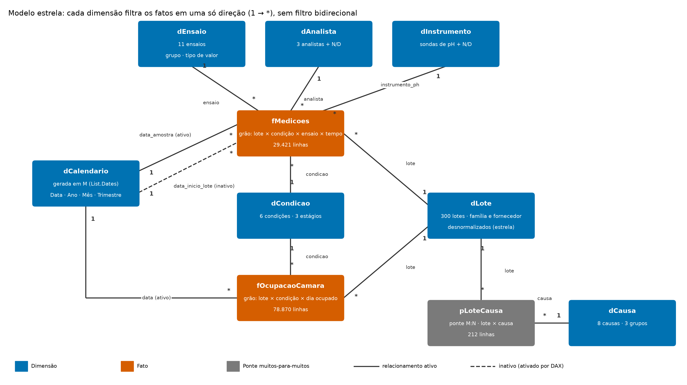
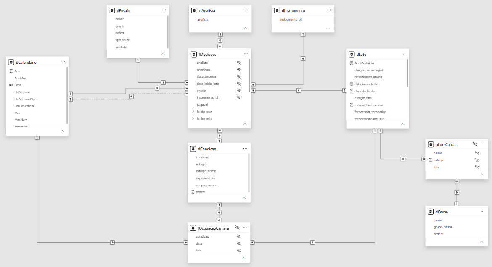
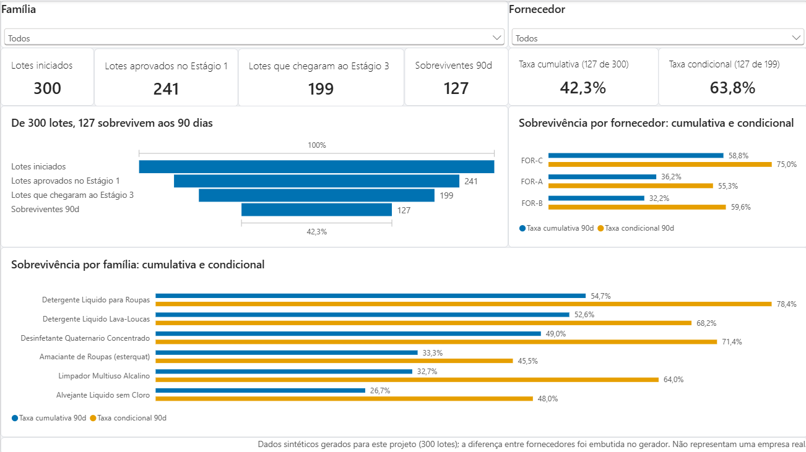
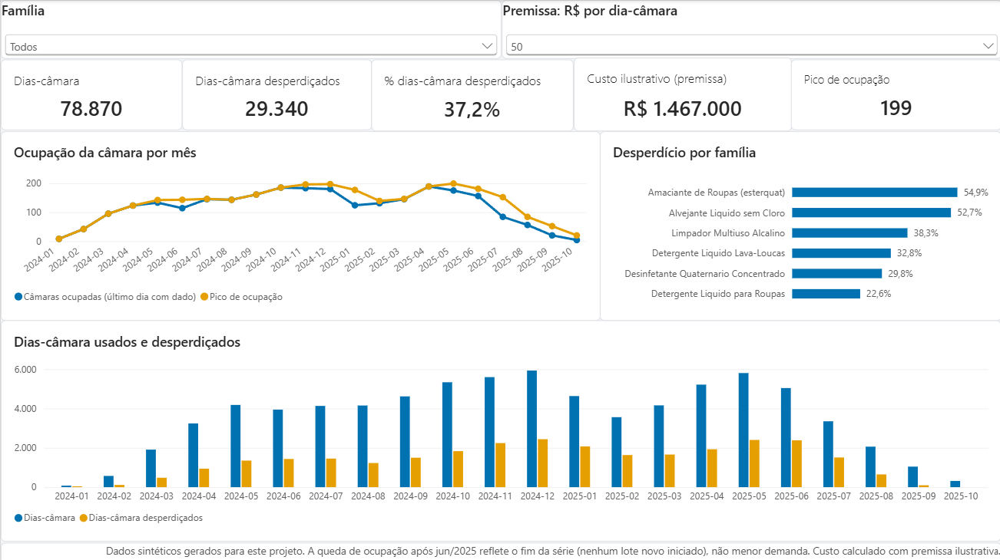
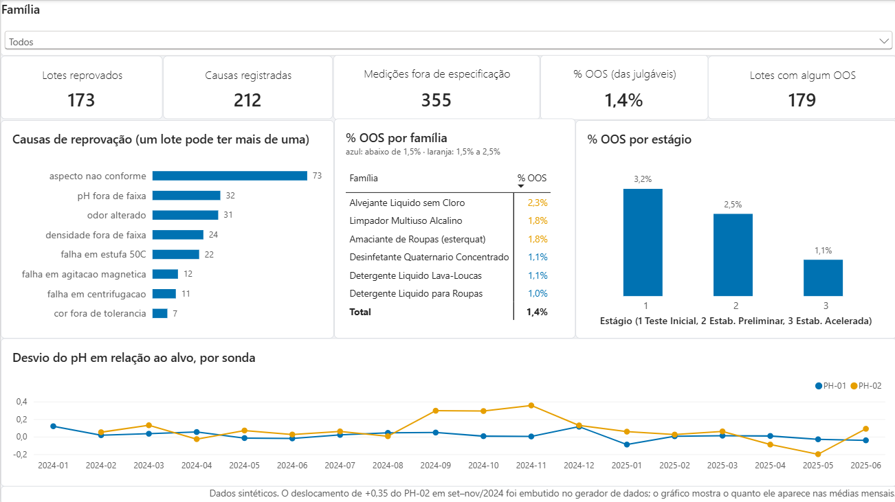

# Modelo semântico de estabilidade (Power BI)

Modelo estrela sobre os dados do funil de estabilidade de formulados. A pergunta que ele responde:

> **Quanto do tempo de câmara climática é consumido por formulações que acabam reprovadas, e onde (família, fornecedor, causa) esse desperdício se concentra?**

No dataset sintético, **37,2% dos dias-câmara (29.340 de 78.870) foram ocupados por lotes que não sobreviveram aos 90 dias.** Esse é o número-âncora do relatório.



Captura da Exibição de modelo no Power BI Desktop (a linha pontilhada entre `dCalendario` e `fMedicoes` é o relacionamento inativo; as setas indicam o filtro de dimensão para fato):



## Estado desta entrega

| Item | Estado |
|---|---|
| Dataset (`data/dados_longo.csv`) | datas do estágio 3 corrigidas na origem; pipeline 02 a 05 revalidado (ver achado 1) |
| Tabelas do modelo (`dados_modelo/*.csv`) | gerado e validado em pandas; contagens de linhas conferidas no Desktop |
| Valores de referência (`valores_de_referencia.csv`, `referencia_mensal.csv`) | gerado; asserções contra os números do README do projeto passaram |
| Scripts Power Query (`M/*.pq`) | executados no Power BI Desktop 2.158.1177.0 |
| Medidas, colunas e tabelas DAX (`DAX/*.dax`) | executadas no Desktop: 43 medidas, 3 tabelas e 3 colunas calculadas |
| Validação numérica (`DAX/validacao.dax`) | os 7 blocos coincidem com os valores de referência (2026-10-05); os blocos 5 (22 meses) e 7 (24 meses) foram comparados por código, 0 divergências |
| Testes de comportamento | 6 de 6 passaram (ver "Registro dos testes no Desktop") |
| Arquivo `.pbix` | `funil-estabilidade.pbix` |
| Relatório | 3 páginas concluídas, com tema acessível, ordem de tabulação e texto alternativo (ver "Páginas do relatório") |
| Grupo de cálculo (`DAX/grupo_de_calculo_visao_temporal.md`) | opcional; **não implementado** |

O modelo foi escrito sem acesso ao Power BI Desktop e depois executado nele. A garantia de correção vem da conferência: `DAX/validacao.dax` reproduz no modelo cada valor de referência calculado em pandas, e qualquer divergência apontaria um erro de relacionamento, de tipo ou de medida.

## Tabelas e grão

| Tabela | Tipo | Grão | Linhas |
|---|---|---|---|
| `fMedicoes` | fato | lote × condição × ensaio × tempo (dias) | 29.421 |
| `fOcupacaoCamara` | fato | lote × condição × **dia ocupado** | 78.870 |
| `pLoteCausa` | ponte M:N | lote × causa de reprovação | 212 |
| `dLote` | dimensão | lote (família e fornecedor já desnormalizados) | 300 |
| `dCondicao` | dimensão | condição de armazenamento (6) e estágio (3) | 6 |
| `dEnsaio` | dimensão | ensaio, grupo e tipo de valor | 11 |
| `dAnalista` | dimensão | analista, mais `N/D` | 4 |
| `dInstrumento` | dimensão | sonda de pH, mais `N/D` | 3 |
| `dCausa` | dimensão | causa normalizada e agrupada | 8 |
| `dCalendario` | dimensão | dia; **gerada em M**, não importada | 731 |
| `dSeletorTaxa`, `dParametroCusto` | desconectadas | seletor e parâmetro what-if | 2 e 51 |

### Relacionamentos

Todos são 1 → * (dimensão para fato), filtro em uma direção só.

| De (1) | Para (*) | Estado |
|---|---|---|
| `dCalendario[Data]` | `fMedicoes[data_amostra]` | ativo |
| `dCalendario[Data]` | `fMedicoes[data_inicio_lote]` | **inativo** (ativado por `USERELATIONSHIP`) |
| `dCalendario[Data]` | `fOcupacaoCamara[data]` | ativo |
| `dLote[lote]` | `fMedicoes[lote]`, `fOcupacaoCamara[lote]`, `pLoteCausa[lote]` | ativo |
| `dCondicao[condicao]` | `fMedicoes[condicao]`, `fOcupacaoCamara[condicao]` | ativo |
| `dEnsaio[ensaio]` | `fMedicoes[ensaio]` | ativo |
| `dAnalista[analista]` | `fMedicoes[analista]` | ativo |
| `dInstrumento[instrumento_ph]` | `fMedicoes[instrumento_ph]` | ativo |
| `dCausa[causa]` | `pLoteCausa[causa]` | ativo |

## Decisões de modelagem

**1. Papel duplo da data, e por que ele não passa por `dLote`.** O plano inicial dizia "data de fabricação × data de análise". O dataset não tem data de fabricação; tem `data_inicio_teste` (início do estudo do lote) e `data_amostra` (dia de cada medição). O papel duplo usa esse par. `data_inicio_lote` é replicada como chave estrangeira em `fMedicoes` porque ligar o calendário também a `dLote` criaria dois caminhos de filtro até `fMedicoes` (ambiguidade), e o Power BI desativaria um deles sem aviso.

**2. Ponte M:N entre lote e causa, sem filtro bidirecional.** O plano inicial citava uma ponte lote↔ensaio. Os dados pedem lote↔causa: 32 dos 173 lotes reprovados têm mais de uma causa gravada em texto com `;`, algumas repetidas ("aspecto nao conforme; aspecto nao conforme; odor alterado"). A ponte normaliza (com deduplicação) em 212 linhas. `dLote` e `dCausa` são o lado "1" e a ponte é o lado "*" de ambos, então nenhum precisa de filtro bidirecional: as medidas contam a partir da ponte (`DISTINCTCOUNT(pLoteCausa[lote])`). Consequência aceita: a soma de "lotes por causa" passa de 173, porque um lote com duas causas aparece nas duas.

**3. Duas taxas de sobrevivência, nunca misturadas.** A taxa cumulativa (127/300 = 42,3%) e a condicional (127/199 = 63,8%) respondem perguntas diferentes, como já distingue o README do projeto. A medida `Taxa de sobrevivência (seletor)` e a tabela desconectada `dSeletorTaxa` alternam entre elas e foram validadas (teste 2), mas **as páginas finais mostram as duas taxas lado a lado e a tabela fica oculta**. Motivo: a ordem de FOR-A e FOR-B se inverte entre as definições (cumulativa 36,2% × 32,2%; condicional 55,3% × 59,6%), e um segmentador esconderia isso de quem não clica. Além disso, a taxa condicional usa poucos lotes por fornecedor (76, 47 e 76 que chegaram ao Estágio 3), então a ordem entre FOR-A e FOR-B nessa definição não deve ser lida como conclusão.

**4. OOS de medição não é reprovação de lote.** 179 lotes têm pelo menos uma medição fora de especificação, mas só 173 foram reprovados. As duas medidas coexistem e o contraste entre elas é intencional.

**5. Colunas removidas da fato.** `descritivo` (texto livre, 14.286 valores preenchidos, cardinalidade alta), `produto_familia` (redundante com `dLote`), `estagio` (vem de `dCondicao`), `criterio_tipo` e `excecao_permitida`. Nenhuma tem uso analítico na fato e todas aumentam o tamanho do modelo.

**6. Nulos de chave viram `N/D`.** `analista` e `instrumento_ph` são nulos em 100% das medições dos estágios 2 e 3 (e preenchidos em 100% do estágio 1). Deixar nulo criaria o membro (Blank) nos segmentadores. Consequência: análise por analista ou por sonda só faz sentido no estágio 1.

**7. Semiaditiva por construção.** `fOcupacaoCamara` tem uma linha por dia ocupado. Somar linhas dá dias-câmara (aditivo). Contar linhas de um único dia dá câmaras ocupadas (foto, não aditivo no tempo). A medida `Câmaras ocupadas (último dia com dado)` usa `LASTNONBLANK` para respeitar isso.

## Achados sobre o dataset e decisões tomadas

1. **Estágios 2 e 3 sobrepostos: corrigido na origem.** Em `02_preparar_dados.py`, a data da amostra do estágio 3 era `data_inicio + tempo_dias`, o que colocava a janela do estágio 3 no mesmo dia da janela do estágio 2 (defasagem 0 nos 1.037 grupos), embora o funil seja sequencial. Passou a ser `data_inicio + 30 dias (portão do estágio 2) + tempo_dias`. A correção foi validada antes de ser aplicada: rodei o pipeline 02 a 05 numa cópia isolada sem alteração (idêntica ao repositório, byte a byte, inclusive os PNGs) e numa cópia corrigida. **O único arquivo que difere é `data/dados_longo.csv`**, e nele só mudou `data_amostra` das 23.880 linhas do estágio 3 (+30 dias). Nenhum julgamento, nenhuma taxa e nenhuma figura de `output/` mudou, porque o único ensaio cuja spec muda de versão (`delta_e_liberacao`, v1.0 → v1.1 em 2024-10-01) pertence ao estágio 1. Efeito no modelo: o total de dias-câmara e o desperdício não mudam; o **pico de ocupação caiu de 208 para 199 câmaras (em 2025-05-15)**, o que mostra que o pico anterior era um artefato da sobreposição, e a série passou a terminar em outubro de 2025. O exportador `06` agora falha se os estágios voltarem a se sobrepor.
2. **Lotes reprovados no estágio 3 permanecem 90 dias na câmara** (288 combinações lote × condição, todas com `tempo_dias` máximo de 90), porque o critério só é julgado ao final. Também cumpriram os 30 dias do estágio 2. Por isso cada um consumiu 30 + 360 = 390 dias-câmara, não 360. É uma propriedade do desenho do estudo e permanece.
3. **Custo: a métrica principal é dias-câmara, não reais.** O dataset não contém custo. O número-âncora do relatório é **37,2% dos dias-câmara desperdiçados**, que vem dos dados. O valor em reais (R$ 1.467.000 com R$ 50 por dia-câmara) aparece só como análise de sensibilidade, pelo parâmetro `dParametroCusto`, e sempre rotulado como premissa ilustrativa.
4. **pH só é interpretável dentro de uma família.** Os alvos vão de 3,2 (amaciante) a 10,2 (limpador alcalino), então a média e o desvio-padrão globais (6,97 e 2,49) misturam escalas. A validação usa o desvio contra o alvo da família (`Desvio médio do pH vs alvo`, -0.0892 no total) e a média e o desvio-padrão **por família** (desvio-padrão entre 0,21 e 0,30). As medidas globais continuam disponíveis, mas nenhum visual deve exibi-las sem filtro de família.
5. **`cor_score` não tem critério na spec** e, junto com as 8 medições fisicamente impossíveis, forma as 4.770 linhas não julgáveis. O denominador do `% OOS` usa só as 24.651 julgáveis.
6. **8 medições de pH fisicamente impossíveis** (por exemplo 42,3) permanecem na fato com `valor_impossivel = true` e são excluídas de toda estatística. Eliminá-las na origem esconderia o diagnóstico de qualidade do dado.

## Passo a passo no Power BI Desktop

1. **Parâmetro.** Transformar dados > Gerenciar parâmetros > Novo: `pCaminhoDados`, tipo Texto, valor = caminho absoluto da pasta `powerbi\dados_modelo` (modelo em `M/pCaminhoDados.pq`).
2. **Carga.** Para cada arquivo em `M/` (exceto `dCalendario.pq` e `pCaminhoDados.pq`): Nova fonte > Consulta em branco > Editor avançado > colar. Renomear a consulta para o nome do arquivo. Carregar `fMedicoes` antes do calendário.
3. **Calendário.** Colar `M/dCalendario.pq` como consulta em branco chamada `dCalendario`. Depois de aplicar, Modelagem > Marcar como tabela de datas > `Data`.
4. **Tabelas e colunas calculadas.** Executar `DAX/tabelas_e_colunas_calculadas.dax` na ordem: as três tabelas; a medida `[Medições OOS]` (indicada no arquivo, pois a primeira coluna depende dela); e só então as três colunas de `dLote`.
5. **Relacionamentos.** Exibição de modelo, conforme a tabela acima. Criar o de `data_inicio_lote` e desmarcar "Tornar este relacionamento ativo". Confirmar que nenhum tem filtro bidirecional.
6. **Ordenação e visibilidade.** Classificar por coluna conforme a lista no fim de `tabelas_e_colunas_calculadas.dax`. Ocultar as colunas de chave estrangeira das tabelas fato e a coluna `Value` da tabela `_Medidas` (criada por `{ BLANK () }`; não é uma medida).
7. **Medidas.** Colar `DAX/medidas.dax` na exibição de consulta DAX e atualizar o modelo. **Definir o formato de exibição de cada medida** (o `.dax` não grava formato; ver tabela abaixo). Pastas de exibição são opcionais.
8. **Validação.** Rodar os sete blocos de `DAX/validacao.dax` e comparar com `valores_de_referencia.csv`, `referencia_mensal.csv` e `referencia_inteligencia_tempo.csv`. **Não avançar para os visuais antes de todos coincidirem.**
9. **Grupo de cálculo.** Seguir `DAX/grupo_de_calculo_visao_temporal.md` (Tabular Editor).
10. **Relatório.** Ver a seção seguinte.
11. **Documentação.** Exportar o modelo pela exibição de consulta DAX para versionar `medidas.dax` e capturar as telas.

### Formato de exibição das medidas

Sem formato, as medidas aparecem como decimais (a taxa de 42,3% sai como 0,42). Defina na **Exibição de modelo**, selecionando várias medidas (Ctrl) e abrindo o painel Propriedades > Formatação:

| Formato | Medidas |
|---|---|
| Porcentagem, 1 casa | Taxa cumulativa 90d; Taxa condicional 90d; Taxa de sobrevivência (seletor); Participação do fornecedor na família; % dos lotes reprovados com a causa; % OOS; % dias-câmara desperdiçados; Variação de medições vs ano anterior |
| Inteiro com separador de milhar | contagens de lotes; Reprovados (3 medidas); Lotes por causa; Causas registradas; Medições (todas as variantes); Lotes com algum OOS; Dias-câmara; Dias-câmara desperdiçados; Câmaras ocupadas (último dia com dado); Pico de ocupação |
| Moeda R$ | Valor por dia-câmara (premissa); Custo desperdiçado (R$, premissa) |
| Decimal, 2 casas | Causas por lote reprovado (média); Ocupação média; ΔE médio de estabilidade; Lotes iniciados (média móvel 3M); pH médio; pH mediana; pH percentil 95; pH desvio-padrão |
| Decimal, 4 casas | Desvio médio do pH vs alvo |

Nos cartões do relatório, defina também **Unidades de exibição: Nenhum**; do contrário 1.467.000 aparece como "1 Mi".

## Páginas do relatório

O relatório tem três páginas. Todas têm o aviso de dados sintéticos no rodapé.

1. **Funil de estabilidade.** Segmentadores de família e fornecedor; seis cartões (300 lotes iniciados, 241 aprovados no Estágio 1, 199 que chegaram ao Estágio 3, 127 sobreviventes, taxa cumulativa 42,3%, taxa condicional 63,8%); funil por estágio; barras agrupadas por fornecedor e por família com as duas taxas. O rodapé informa que a diferença entre fornecedores foi embutida no gerador. A matriz família × fornecedor (`Participação do fornecedor na família`) e o `Ranking do fornecedor` ficam no modelo, sem visual.



2. **Câmara e custo.** Segmentadores de família e da premissa de R$ por dia-câmara (padrão R$ 50); cinco cartões (78.870 dias-câmara, 29.340 desperdiçados, 37,2%, custo ilustrativo de R$ 1.467.000 e pico de 199); ocupação por mês (último dia com dado e pico); dias-câmara usados e desperdiçados por mês; e % de dias-câmara desperdiçados por família (de 54,9% no Amaciante a 22,6% no Detergente para Roupas). Nota na página: a queda após jun/2025 reflete o fim da série, não menor demanda.



3. **Causas e qualidade.** Cinco cartões (173 lotes reprovados, 212 causas registradas, 355 medições OOS, 1,4% de OOS, 179 lotes com algum OOS); lotes por causa (um lote pode ter mais de uma); `% OOS` por família com semáforo (azul abaixo de 1,5%, laranja de 1,5% a 2,5%); `% OOS` por estágio (3,2%, 2,5% e 1,1%); e o desvio médio do pH por sonda por mês, em que o PH-02 sobe para cerca de +0,3 entre set e nov/2024. Esse deslocamento (+0,35) foi embutido no gerador.



Não implementados, como evolução futura: página de detalhe do lote (drillthrough), página de dica de ferramenta e visual em Python.

Tema de cores acessível para daltonismo (paleta Okabe-Ito, a mesma do semáforo), no arquivo `tema_funil_estabilidade.json` (Exibição > Temas > Procurar temas). Ordem de tabulação revisada e texto alternativo nos gráficos, nas três páginas.

## Registro dos testes no Desktop

Executados em 2026-10-02, Power BI Desktop 2.158.1177.0.

| Teste | Resultado |
|---|---|
| Blocos 1 a 4 e 6 de `validacao.dax` | coincidem com os valores de referência |
| Bloco 5 (série mensal, 22 meses) | 0 divergências nas cinco colunas; somas 300 lotes, 29.421 medições, 78.870 dias-câmara; pico 199 em 2025-05 |
| Papel duplo da data | lotes iniciados (data de início) e medições (data da amostra) diferem no mesmo mês; lotes ficam em branco de 2025-07 a 2025-10 (nenhum lote iniciado) |
| Seletor de taxa | alterna 42,3% e 63,8% |
| Ponte lote × causa | total 173; as linhas somam 212 |
| Semiaditiva | total de dias-câmara 78.870; câmaras ocupadas no total igual ao último mês (4) |
| Inteligência de tempo (bloco 7) | 24 meses × 5 colunas sem divergência. A média móvel de 3 meses foi corrigida antes: a janela com `DATESINPERIOD` incluía o último dia do mês anterior em meses de 30 dias e em fevereiro (erraria em 5 de 24 meses); passou a usar `EOMONTH` e `DATESBETWEEN` |
| Semáforo | azul em 1,0% a 1,1%, laranja em 1,8% a 2,3% (limites 1,5% e 2,5%) |
| Parâmetro de custo | R$ 50 → R$ 1.467.000; custo proporcional ao valor escolhido |

## Tópicos da PL-300

Conferido contra a lista de tópicos que o projeto se propôs a exercitar. "Coberto" significa que existe no modelo ou no relatório; o que não foi feito está listado abaixo.

**Coberto**

| Domínio | Tópico | Onde |
|---|---|---|
| Preparar | Parâmetros de consulta | `pCaminhoDados` |
| Preparar | `List.Dates()` em M | `M/dCalendario.pq` |
| Preparar | Tipos de dado explícitos; chaves para relacionamentos | `M/*.pq`; `dLote[lote]` e demais chaves |
| Modelar | Tabela de datas dedicada marcada como tal | `dCalendario` |
| Modelar | Inteligência de tempo | `SAMEPERIODLASTYEAR`, `TOTALYTD`, `DATESBETWEEN` em `medidas.dax` (bloco 7 de validação) |
| Modelar | Dimensão de papel duplo, relacionamento ativo e inativo | `data_amostra` × `data_inicio_lote`, `USERELATIONSHIP` |
| Modelar | Muitos-para-muitos por tabela ponte, sem filtro bidirecional | `pLoteCausa` |
| Modelar | Cardinalidade e direção de filtro | relacionamentos 1 → * de direção única |
| Modelar | `CALCULATE`, variáveis, transição de contexto | `dLote[Medicoes OOS do lote]`, medidas com `VAR` |
| Modelar | `ALL`, `ALLEXCEPT`, `ALLSELECTED`, `RANKX` | grupos 01 e 02 de medidas |
| Modelar | Funções estatísticas básicas | mediana, percentil, desvio-padrão (grupo 04) |
| Modelar | Medidas semiaditivas | `Câmaras ocupadas (último dia com dado)` |
| Modelar | Coluna calculada × tabela calculada × medida | `dLote[...]`, `dSeletorTaxa`, `dParametroCusto`, `_Medidas` |
| Modelar | Propriedades de tabela e coluna: ordenar por coluna, ocultar, formatar, resumir por | `README_MODELO.md`, passos 6 e 7 |
| Modelar | Tabela desconectada, `SELECTEDVALUE`, parâmetro what-if | `dSeletorTaxa`, `dParametroCusto` |
| Modelar | Exibição de consulta DAX | `DAX/validacao.dax` |
| Visualizar | Formatação condicional por *Valor do campo* | `Cor do semáforo (% OOS)` |
| Visualizar | Tema acessível, texto alternativo, ordem de tabulação | três páginas do relatório |

**Cobertura parcial**

| Tópico | O que foi feito e o que faltou |
|---|---|
| Mesclar para esquema estrela | O esquema estrela existe, mas a desnormalização de família e fornecedor em `dLote` foi feita em pandas (`06_exportar_modelo_bi.py`), não com *Mesclar consultas* no Power Query |
| `FILTER`, `DISTINCT` | Não usados; o modelo usa `CALCULATE` com filtros diretos e `DISTINCTCOUNT` |
| Medidas implícitas × explícitas | Todo o relatório usa medidas explícitas; a regra de *Resumir por* foi aplicada a `dCondicao[estagio]`, mas não há um exemplo comparativo |

**Não coberto**

Unpivot, pivot, transposição e agrupamento no Power Query (os dados já estão em formato longo); medidas rápidas; hierarquias e pastas de exibição; grupos de cálculo (há um guia escrito em `DAX/grupo_de_calculo_visao_temporal.md`, mas não foi implementado); dica de ferramenta personalizada; drillthrough e indicadores; visuais em Python ou R.

## Como abrir o `.pbix`

O arquivo guarda o caminho da pasta de dados em um parâmetro de consulta. Depois de baixar o repositório:

1. Abra `powerbi/funil-estabilidade.pbix` no Power BI Desktop.
2. Página inicial > **Transformar dados** > **Gerenciar parâmetros** > `pCaminhoDados`: troque o valor pelo caminho completo da pasta `powerbi\dados_modelo` no seu computador, sem barra no final.
3. **Fechar e aplicar**.

Sem esse ajuste, o Desktop avisa que não encontra os arquivos CSV.

## Reprodução

```bash
python src/06_exportar_modelo_bi.py     # regera powerbi/dados_modelo e os valores de referência
```

O script é determinístico e falha (asserção) se os números do funil deixarem de bater com os do README do projeto.
