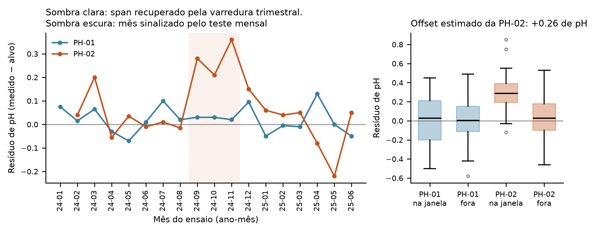
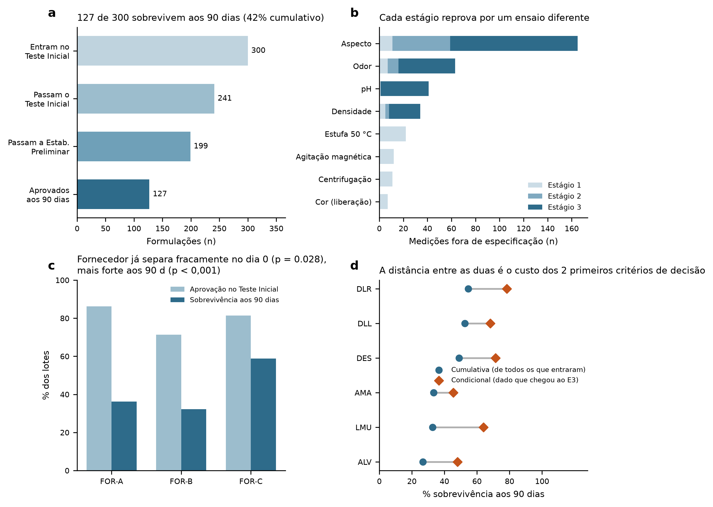
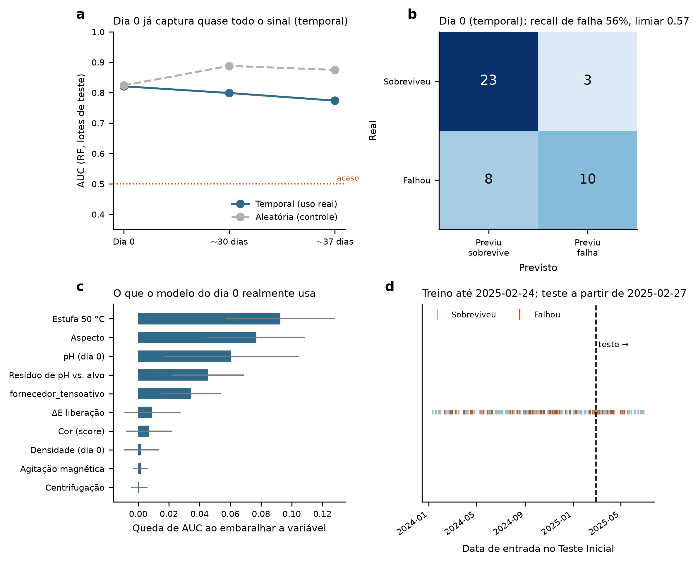
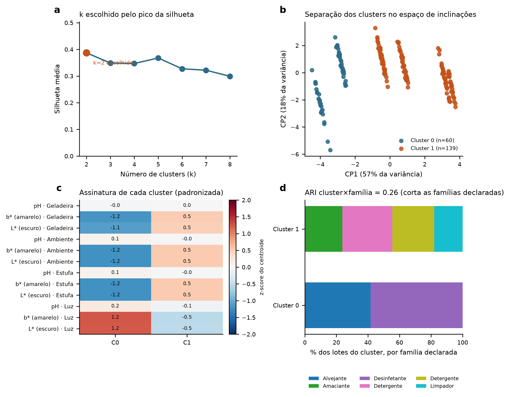

# Relatório técnico: funil de estabilidade de produtos formulados

Documento de apoio ao [`README.md`](../README.md). Aqui vai a metodologia, a justificativa de cada escolha de domínio e os números completos por trás de cada figura, explicados com um pouco mais de contexto do que cabe no README. Todos os dados são sintéticos (ver `../FONTES.md`); nenhum valor deriva de produto, cliente ou processo de uma empresa real.

---

## 1. Desenho do estudo

O funil tem três estágios, cada um terminando num critério de decisão. É a mesma sequência usada na prática de laboratório de desenvolvimento: primeiro uma triagem rápida e barata, depois testes mais longos só com quem passou a triagem.

| Estágio | Ensaios avaliados | Quando | Critério de decisão |
|---|---|---|---|
| 1. Teste Inicial | pH, densidade, ΔE₀₀ de liberação, aspecto, odor, estufa 50 °C, centrifugação, agitação magnética | dia 0 | se reprova em qualquer ensaio, encerra o estudo |
| 2. Estabilidade Preliminar | pH, densidade, ΔE₀₀, aspecto, odor, sob choque térmico (geladeira 5 °C ↔ estufa 40 °C, dias alternados) | 15 e 30 dias | se reprova ao final de 30 dias, encerra o estudo |
| 3. Estabilidade Acelerada | pH, densidade, ΔE₀₀, aspecto, odor, em 4 condições de armazenamento (ambiente escuro 25 °C, estufa 40 °C, geladeira 5 °C, luz solar) | 7, 15, 30, 60 e 90 dias | resultado final aos 90 dias |

A justificativa de cada tempo e condição está em `../FONTES.md`. Em resumo: o desenho segue a estrutura de estudo da ISO/TR 18811:2018 e do guia de estabilidade de cosméticos da ANVISA, e a fotoestabilidade segue a lógica de dose do ICH Q1B, a exposição à luz é medida em dose acumulada, não em tempo de relógio, por isso a condição "Luz Solar" tem seu próprio mecanismo de deriva (§2.1).

**Regra de liberação: conjunção lógica (AND), nunca por pontuação combinada.** A aprovação de um lote exige conformidade em todos os parâmetros simultaneamente; não existe compensação entre atributos (um pH ótimo não cobre uma cor fora de especificação). É isso que a tabela de regras `spec_master.csv` implementa: cada ensaio tem seu próprio limite e vigência, e a falha em qualquer um reprova o lote inteiro. No Passo 4, uma pontuação combinada é calculada a partir dos mesmos dados, mas só como ferramenta de análise (importância por permutação, ver §5.6), nunca para decidir liberação.

---

## 2. Geração do dataset (`01_gerar_dataset.py`)

### 2.1 Mecanismo de geração e a variável oculta

Cada lote recebe uma **qualidade oculta** (a robustez real da formulação, nunca medida diretamente em laboratório), sorteada com um viés que depende do fornecedor de tensoativo. Essa variável não observada governa, ao mesmo tempo, os escores de estresse do Teste Inicial (estufa 50 °C, centrifugação) e as taxas de deriva ao longo da Estabilidade Acelerada. Esse acoplamento é o que torna a previsão antecipada possível sem vazamento de dados: o dia 0 e o dia 90 são duas observações ruidosas da mesma causa oculta, não dois conjuntos de dados desconectados que um modelo aprenderia a colar por coincidência.

A variável oculta **nunca é exposta como feature**: ela é descartada no momento de gravar o CSV (`e1.drop(columns=["robustez_latente"])`). Essa exclusão é deliberada. Se a variável estivesse disponível, o modelo do Passo 4 a usaria diretamente, e a previsão deixaria de ser sobre química mensurável para ser sobre um número que não existe numa bancada de verdade.

A deriva segue dois mecanismos físicos distintos, escolhidos de propósito para serem diferenciáveis por análise (ver §5.6): um mecanismo **térmico**, que segue a lei de Arrhenius e atua em pH e densidade com velocidade proporcional à temperatura de armazenamento, e um mecanismo **fotoquímico**, dependente de dose de luz, que atua em b* (amarelecimento) e L* (escurecimento) apenas na condição "Luz Solar".

### 2.2 Cor: ΔE₀₀ calculado, nunca sorteado diretamente

O gerador sorteia L*, a*, b* da amostra em torno do padrão da família e **calcula** o ΔE₀₀ a partir desses três componentes, nunca sorteia o ΔE diretamente. Essa ordem garante duas propriedades que um ΔE real também tem: o valor é sempre não negativo e a distribuição é assimétrica; e os componentes dL*/da*/db* ficam disponíveis para diagnosticar a causa (amarelecimento vs. escurecimento), que é exatamente o que a clusterização do Passo 5 usa como variável de entrada.

A fórmula **ΔE₀₀ (CIEDE2000)** é usada para diferença de cor. A norma ASTM D2244 recomenda ΔE₀₀ especificamente para diferenças pequenas, de 0 a 5 unidades, a faixa em que a liberação e a maior parte da estabilidade deste projeto operam (a fórmula mais antiga, de 1976, sub-representa a diferença perceptual real nessa faixa e funciona melhor para diferenças grandes).

### 2.3 Duas tolerâncias de cor, deliberadamente diferentes

- `delta_e_liberacao`: compara o lote contra o padrão da família, no dia 0 (T0). Tolerância apertada (pela `spec_master`: 1,50 a partir de 2024-10-01; 2,00 antes dessa data, ver §3.2).
- `delta_e_estabilidade` / `delta_e_estabilidade_luz`: compara o lote contra ele mesmo, ao longo do estudo. Tolerância mais larga, e a condição de luz tem limite próprio (fotoestabilidade, conforme ICH Q1B), porque alteração de cor sob exposição solar direta é um resultado esperado do estudo, não um motivo de reprovação na liberação.

As duas tolerâncias não são intercambiáveis: julgar a liberação pelo ΔE medido aos 90 dias sob luz produziria valores de até 11 unidades, porque essa medida capta estresse fotoquímico acumulado, não desvio do padrão comercial. A função `oos_estabilidade()` condiciona o limite de cor à condição de armazenamento em que a medição foi feita, aplicando o limite de liberação apenas no T0 e o de fotoestabilidade apenas sob luz solar.

### 2.4 Erros de laboratório injetados (com gabarito)

42 erros distribuídos em 3 tipos, cada um com um mecanismo realista de acontecer numa rotina de bancada:

| Tipo | n | Mecanismo | Detectável por outlier univariado? |
|---|---|---|---|
| Decimal deslocado | 8 | fator 10x no registro | Sim: recall 100% (faixa física e MAD) |
| Replicata trocada | 5 | duas leituras invertidas | Parcial: recall 60% |
| Sonda descalibrada | 24 | offset sistemático de instrumento, set-nov/2024 | **Não**: recall 4-13%, requer comparação entre instrumentos |

O terceiro tipo é o ponto pedagógico do dataset. Um offset aditivo (a sonda sempre lê +0,3 acima do real, por exemplo) mantém cada valor individualmente plausível, nada nele "parece errado" se olhado sozinho. Nenhuma comparação de um valor contra seus pares o encontra; só a comparação entre instrumentos, ao longo do tempo, revela o desvio (§3.4).

---

## 3. Preparação e qualidade do dado (`02_preparar_dados.py`)

### 3.1 Validação de schema (Pandera): o que ela valida e o que não valida

A ingestão dos 7 CSV passa por schemas Pandera que verificam estrutura: coluna presente, tipo correto, categoria pertencente ao conjunto esperado. Eles não verificam se o valor medido é fisicamente possível: um pH de 48,70 passa pelo schema sem problema (é um número `float` válido) e só é sinalizado como impossível na Seção 5 do script, que é lógica de negócio, não de ingestão.

Essa fronteira importa na prática: se o schema já rejeitasse valores fisicamente impossíveis, o script falharia exatamente no dado que ele foi escrito para diagnosticar, e o diagnóstico nunca aconteceria. A distinção:

- **Schema (Pandera):** um LIMS que exportasse `"Aprovada"` em vez de `"Aprovado"`, ou omitisse uma coluna, é falha de ingestão, corrige-se na origem do dado.
- **Regra de negócio (Seções 5-10):** um pH de 48,70 num CSV bem formado é falha de medição, gera um diagnóstico (outlier, medição inválida) com contagem, não um erro de programa.

Essa validação é rígida o suficiente para capturar uma categoria fora do conjunto esperado (por exemplo, um valor de condição de armazenamento que não existe na `spec_master`) antes de qualquer cálculo, apontando a coluna e o valor exatos, o comportamento esperado de uma validação de estrutura.

### 3.2 Junção pela vigência da especificação, não pela spec atual

Cada medição é julgada contra a versão da `spec_master` que estava vigente na data da amostra, através de uma junção "as-of" (a data da medição precisa cair dentro da janela `vigente_de`-`vigente_ate` daquela versão da spec). A tolerância de cor na liberação foi revisada de 2,00 para 1,50 em 2024-10-01, justificada pela implantação de um colorímetro de bancada mais preciso naquela data. Ignorar essa vigência e julgar todo o histórico pela spec de hoje mudaria a disposição de **5 lotes**. É um número pequeno, mas o script existe justamente para medir esse tipo de erro sistemático, o tipo que uma auditoria apressada cometeria sem notar.

### 3.3 Teste de sanidade: a regra reconstruída bate com o registro?

Reaplicando a `spec_master` do zero sobre as medições do Estágio 1, a disposição calculada coincide com o `status_estagio1` registrado em **292 dos 300 lotes**. As 8 divergências são todas explicadas por medição fisicamente impossível; nenhuma é erro de regra. Esse resultado confirma, ao mesmo tempo, a Seção 2.4 do gerador e a Seção 6 do preparador: a regra de negócio é reproduzível byte a byte a partir da especificação escrita.

### 3.4 Viés de instrumento: dois testes, duas resoluções diferentes

O offset da sonda PH-02 é detectado comparando os dois instrumentos por período de tempo, sobre o resíduo em relação ao alvo de pH da família (o resíduo remove o efeito da família, que é maior que o offset procurado).

- **Teste mensal** (Mann-Whitney, com correção de Bonferroni para os meses testados): não sinaliza nenhum mês isoladamente. Com cerca de 8 lotes por instrumento por mês, falta potência estatística para detectar o offset real de +0,35 nessa granularidade.
- **Varredura em janela de 3 meses**: recupera o intervalo **setembro a novembro de 2024**, com offset estimado de **+0,26**, que subestima o valor injetado (+0,35).

Os dois testes são reportados juntos porque respondem perguntas diferentes: o mensal tem mais especificidade (localizaria com precisão de mês, se tivesse potência suficiente para isso), o trimestral tem mais sensibilidade (localiza com precisão de trimestre, mas de fato encontra o efeito). Reportar só um dos dois esconderia essa diferença de resolução, por isso os dois aparecem juntos, com a ressalva.

### 3.5 Detecção de fora de tendência nas séries de estabilidade: duas tentativas erradas, documentadas

O script tentou, nesta ordem:
1. **Filtro de Hampel direto na série** -> 220 sinalizações espúrias. A série deriva por construção (é esperado que o valor mude com o tempo); o filtro marca justamente as pontas da tendência, que são o comportamento esperado, não um erro.
2. **Remover a tendência e filtrar o resíduo** -> 451 sinalizações, pior ainda. Cada série tem só 5 pontos no tempo; 2 graus de liberdade vão para a reta ajustada, e o desvio-padrão robusto (MAD) dos resíduos fica instável com tão poucos pontos.
3. **Comparar cada lote com os outros lotes da mesma família, condição e tempo** (um intervalo de tolerância por ponto, a lógica correta de detecção de fora de tendência, OOT) -> candidatos plausíveis em cerca de 0,25% das medições avaliadas. Funciona porque a referência de comparação passa a ter dezenas de observações, não cinco.

### 3.6 Resultado agregado

| Métrica | Valor |
|---|---|
| Medições totais | 29.421 |
| Fora de especificação (OOS) | 355 |
| Fisicamente impossíveis | 8 |
| Reprovados indevidamente por erro de laboratório | 10 |
| Kappa quadrático (aspecto / centrifugação / estufa) | 0,852 / 0,840 / 0,921 |

---

## 4. Análise do funil (`03_analise_funil.py`)

### 4.1 Atrito, com as duas taxas separadas

| | n | % |
|---|---|---|
| Entram no Teste Inicial | 300 | - |
| Aprovados no Estágio 1 | 241 | 80,3% |
| Aprovados na Estabilidade Preliminar | 199 | 66,3% |
| Sobrevivem aos 90 dias | 127 | **42,3% cumulativo** / **63,8% condicional** |

Cumulativa é sobreviventes dividido por todos que entraram (a taxa de negócio: "de cada 100 formulações que começo, quantas terminam?"). Condicional é sobreviventes dividido por quem chegou ao Estágio 3 (a taxa que importa para o modelo do Passo 4, porque ele só vê quem chegou lá, o funil já filtrou o resto antes).

### 4.2 Cada estágio reprova por um ensaio diferente

O Estágio 1 reprova majoritariamente por **ensaio de estresse físico** (estufa 50 °C: 22 ocorrências; agitação: 12; centrifugação: 11). Os Estágios 2 e 3 reprovam majoritariamente por **deriva ao longo do tempo** (aspecto: 154 ocorrências somadas; odor: 56; pH: 40). Isso confirma que o desenho de três estágios captura fenômenos diferentes: se todos os estágios reprovassem pela mesma causa, seriam redundantes entre si.

### 4.3 O fornecedor de tensoativo: efeito mais forte na sobrevivência do que na triagem

| Fornecedor | n | Aprovação E1 | Sobrevivência 90d (cumulativa) |
|---|---|---|---|
| FOR-A | 116 | 86,2% | 36,2% |
| FOR-B | 87 | 71,3% | 32,2% |
| FOR-C | 97 | 81,4% | **58,8%** |

Teste qui-quadrado: o fornecedor já separa levemente a aprovação no Estágio 1 (χ² = 7,14, p = 0,028), e separa com muito mais força a sobrevivência aos 90 dias (χ² = 16,18, p = 0,0003). O efeito não está ausente no dia 0, mas é bem mais fraco ali do que ao final do estudo, o que é consistente com o desenho do gerador (§2.1): o viés de fornecedor entra pela variável oculta, que afeta tanto o estresse do dia 0 quanto a deriva ao longo de 90 dias, só que a deriva acumula esse efeito ao longo do tempo, e o estresse do dia 0 é um instante só. Ressalva de método: este teste mede o efeito **observado** nos dados disponíveis; a variável oculta em si nunca é usada no teste, porque ela não existe fora do gerador.

### 4.4 Por família: a distância entre cumulativa e condicional é o custo dos dois primeiros portões

| Família | Aprov. E1 | Sobrev. cumulativa | Sobrev. condicional | ΔE fotoestabilidade não conforme |
|---|---|---|---|---|
| Alvejante sem Cloro | 66,7% | 26,7% | 48,0% | 5 |
| Limpador Multiuso | 75,5% | 32,7% | 64,0% | 1 |
| Amaciante (esterquat) | 80,0% | 33,3% | 45,5% | 4 |
| Desinfetante Quaternário | 84,3% | 49,0% | 71,4% | 2 |
| Detergente Lava-Louças | 91,2% | 52,6% | 68,2% | 4 |
| Detergente para Roupas | 81,1% | 54,7% | 78,4% | 2 |

O Alvejante tem a menor aprovação já no Estágio 1 (66,7%): é a única família modelada como suspensão real (§2.1 do dataset), então os ensaios de centrifugação e agitação, que testam justamente separação de fase, têm poder de detecção genuíno nela, coisa que não acontece nas famílias que são soluções verdadeiras. O Limpador Multiuso tem a maior distância entre as duas taxas de sobrevivência (32,7% -> 64,0%): passa a triagem relativamente bem, mas quase a metade dos que chegam ao Estágio 3 não sobrevive aos 90 dias, um padrão consistente com defeito que só se manifesta com o tempo, não no instante da triagem.

---

## 5. Previsão antecipada (`04_previsao_antecipada.py`)

### 5.1 Pergunta e população

Alvo: `falha_90d` (1 = reprovado em algum ponto da Estabilidade Acelerada). Restrito aos **199 lotes que chegaram ao Estágio 3**, o subconjunto que de fato gerou dado de estabilidade completo ao longo dos 90 dias. Taxa de falha nessa população: 36,2% (72 de 199).

### 5.2 Três horizontes, features nunca vazam do futuro

| Horizonte | Features | O que representa |
|---|---|---|
| H0 (dia 0) | `d0_*` (pH, densidade, ΔE liberação, escores de estresse) | decisão no Teste Inicial |
| H1 (~30 dias) | H0 + `e2_*` (deriva na Preliminar) | decisão ao final da Estabilidade Preliminar |
| H2 (~37 dias) | H1 + `d7_*` (1ª leitura da Acelerada, 4 condições) | decisão com uma semana de câmara |

`analista` e `instrumento_ph` foram **excluídos de propósito**: incluí-los arriscaria o modelo aprender "PH-02 entre set-nov/2024 = risco", o viés de instrumento do Passo 2 disfarçado de sinal preditivo, em vez da química real da formulação.

### 5.3 Divisão temporal vs. aleatória

Treino: 155 lotes (2024-01-11 a 2025-02-24). Teste temporal: 44 lotes (2025-02-27 a 2025-06-28). A divisão aleatória usa a mesma proporção de treino e teste, com embaralhamento estratificado por classe. Ela serve de comparação para medir o gap de otimismo; o desempenho real do modelo é o medido na divisão temporal.

### 5.4 Resultados (Random Forest, 400 árvores, profundidade 6, balanceado)

| Horizonte | Divisão | AUC | PR-AUC | Recall falha | Precisão falha |
|---|---|---|---|---|---|
| H0 (dia 0) | **Temporal** | **0,821** | 0,818 | 55,6% | 76,9% |
| H0 (dia 0) | Aleatória | 0,824 | 0,807 | 62,5% | 83,3% |
| H1 (~30 d) | Temporal | 0,799 | 0,830 | 66,7% | 85,7% |
| H1 (~30 d) | Aleatória | 0,888 | 0,885 | 68,8% | 91,7% |
| H2 (~37 d) | Temporal | 0,774 | 0,775 | 61,1% | 78,6% |
| H2 (~37 d) | Aleatória | 0,875 | 0,857 | 75,0% | 85,7% |
| Baseline (classe majoritária) | ambas | 0,500 | - | 0% | - |

**Achado principal: a AUC temporal não sobe com o horizonte** (0,821 -> 0,799 -> 0,774; a variação está dentro do que se espera de ruído amostral para um conjunto de teste de só 44 lotes). O sinal que decide o desfecho já está presente no dia 0. Isso é consistente com o mecanismo do gerador (§2.1): a variável oculta que governa o estresse do dia 0 é a mesma que governa a deriva aos 90 dias, então observar mais tempo não adiciona informação nova, só confirma o que já estava lá. Essa explicação causal é uma leitura post-hoc a partir do desenho do gerador; em um dataset real, o achado equivalente seria simplesmente "a triagem de bancada já captura o essencial", sem a explicação causal disponível para confirmar o porquê.

A divisão aleatória supera a temporal em todos os horizontes, mais claramente em H1 e H2 (0,888 e 0,875 contra 0,799 e 0,774) do que em H0 (0,824 contra 0,821, praticamente empatado). É o padrão esperado quando a distribuição do alvo desloca entre o período de treino e o de teste; a candidata mais provável para essa mudança de distribuição é a revisão de spec de 2024-10-01 (§3.2), que muda o critério de liberação de cor no meio do período coberto pelos dados, mas essa causa específica não foi investigada formalmente.

### 5.5 Limiar por custo

O limiar de decisão não é 0,5: ele é escolhido varrendo candidatos no conjunto de treino para minimizar um custo esperado, com uma razão de 4:1 entre falso negativo (deixar passar uma formulação que vai falhar; ela ocupa 90 dias de câmara climática antes de ser descartada) e falso positivo (investigar uma formulação boa à toa; custa um dia de revisão extra). Para H0 com divisão temporal, o limiar resultante é 0,571; aplicado ao conjunto de teste, dá a matriz de confusão VN=23, FP=3, FN=8, VP=10, ou seja, recall de 55,6% na classe de falha. A razão de custo 4:1 é arbitrária (não foi calibrada contra dado real de custo de câmara ou de investigação de bancada) e está isolada numa constante no topo do script, exatamente para poder ser discutida e substituída por um valor real quando houver um.

### 5.6 O que o modelo do dia 0 realmente usa

Importância por permutação (Random Forest, H0, divisão temporal, 30 repetições): `estufa50_score` domina (queda de AUC de 0,093 quando a coluna é embaralhada), seguido por `aspecto_score` (0,077), `ph` (0,061), o resíduo de pH em relação ao alvo da família (0,045) e o próprio fornecedor de tensoativo (0,034).

`centrifugacao_score` tem importância baixa nesse ranking, apesar de ser um ensaio de estresse físico direto: ele só é genuinamente informativo nas 2 famílias que são emulsão ou suspensão de verdade (§2.1); nas 4 famílias que são solução, a probabilidade de defeito nesse ensaio é baixa e pouco relacionada à variável oculta, então o modelo extrai pouco sinal dele. `estufa50_score`, por ser termicamente relevante para as 6 famílias por igual, é o ensaio mais informativo do conjunto.

---

## 6. Clusterização por assinatura de degradação (`05_clusterizacao.py`)

### 6.1 O vetor de entrada: inclinação da deriva por condição

Para os 199 lotes que chegaram ao Estágio 3, cada um recebe um vetor de 12 números: a inclinação (regressão linear no tempo) de pH, amarelecimento (Δb*) e escurecimento (-ΔL*) em cada uma das 4 condições de armazenamento. Padronizado (z-score) antes de agrupar. Usar inclinação em vez de nível absoluto é a decisão central: dois lotes com pH inicial diferente, mas mesma taxa de deriva, devem cair no mesmo grupo.

### 6.2 k = 2, escolhido pela silhueta, confirmado por método independente

Silhueta média por k testado (K-means, 2 a 8): pico em **k = 2 (silhueta 0,387)**. Uma clusterização hierárquica (Ward) sobre o mesmo vetor, cortada em 2 grupos, concorda completamente com o K-means (ARI = 1,0 entre os dois métodos). Dois algoritmos com lógicas de agrupamento diferentes convergindo na mesma partição é evidência de que a estrutura encontrada é real, não um artefato de um método específico.

### 6.3 O agrupamento junta famílias declaradas diferentes

ARI entre o cluster descoberto e a família comercial declarada: **0,26**, moderado-baixo. O valor é baixo porque dois clusters não podem reproduzir seis rótulos, e não porque famílias sejam divididas: cada família cai inteira em um cluster (tabela abaixo). O agrupamento não reproduz as 6 famílias comerciais, mas junta famílias diferentes.

| Cluster | n | Composição |
|---|---|---|
| 0 | 60 | Alvejante sem Cloro, Desinfetante Quaternário |
| 1 | 139 | Amaciante, Detergente Lava-Louças, Detergente para Roupas, Limpador Multiuso |

O Cluster 0 reúne o alvejante e o desinfetante quaternário e tem assinatura mais fotossensível e menos termossensível que o Cluster 1: a inclinação média do amarelecimento sob luz solar é cerca de 30% maior (0,068 contra 0,052) e cerca de 20% menor na estufa (0,020 contra 0,025). No gerador de dados, essas duas famílias recebem os maiores coeficientes de fotossensibilidade (1,55 e 1,40) e os menores de deriva térmica de cor (0,0050 e 0,0055); são estimativas de engenharia, sem fonte documentada em `FONTES.md`. A clusterização portanto recupera uma estrutura conhecida, o que valida o método, mas não confirma uma explicação química (o desinfetante quaternário é um tensoativo catiônico biocida, não um oxidante; só o alvejante sem cloro é de química oxidante). Com dados reais, seria o tipo de achado que justifica agrupar produtos de famílias comerciais diferentes que compartilham mecanismo de degradação para fins de bracketing/matrixing (ICH Q1D): testar menos condições, mas testar as famílias certas juntas.

### 6.4 Limitação

O vetor usa só pH e cor; densidade e os escores organolépticos (aspecto, odor) não entraram. Um vetor mais completo poderia revelar subestrutura dentro dos 2 clusters atuais; não foi testado nesta versão.

---

## 7. Referências

### Normas e guias regulatórios
- ANVISA, *Guia de Estabilidade de Produtos Cosméticos*, Série Qualidade em Foco, vol. 1
- ANVISA, RDC 59/2010 (art. 3º, classificação de risco de saneantes), RDC 184/2001, RDC 989/2025
- ISO/TR 18811:2018, *Cosmetics — Guidelines on the stability testing of cosmetic products*
- ICH Q1A(R2), Q1B (fotoestabilidade), Q1D (bracketing e matrixing), Q1E (avaliação de dados de estabilidade), Q6A, Q9
- ASTM E70 (pH, eletrodo de vidro); ISO 4316 (pH de tensoativos)
- ASTM D2244 (cálculo de tolerância e diferença de cor); ASTM E308; ISO/CIE 11664-4 e -6; ASTM D1729 (avaliação visual)
- ISO 22716 (boas práticas de fabricação de cosméticos)
- *FDA Guidance for Industry: Investigating Out-of-Specification (OOS) Test Results for Pharmaceutical Production*

### Métodos estatísticos
- Iglewicz, B.; Hoaglin, D., *How to Detect and Handle Outliers*, ASQC, 1993 (z-score modificado / MAD)
- Rousseeuw, P. J.; Van Zomeren, B. C., "Unmasking multivariate outliers and leverage points", *JASA*, 1990
- Montgomery, D. C., *Introduction to Statistical Quality Control*, Wiley (cap. 5-6, 9, 11)
- Literatura de detecção de fora de tendência (OOT) em estabilidade farmacêutica: carta de controle de regressão, intervalo de tolerância por ponto de tempo (usada no Passo 2, §3.5)

Ressalva geral: as faixas de especificação usadas neste dataset (`FONTES.md`) são convenção de prática industrial ou estimativa de engenharia; nenhuma norma citada prescreve valor de tolerância para pH, densidade ou ΔE em saneantes. As normas padronizam método de medição e estrutura de estudo; a especificação em si é definida e justificada pelo fabricante.
